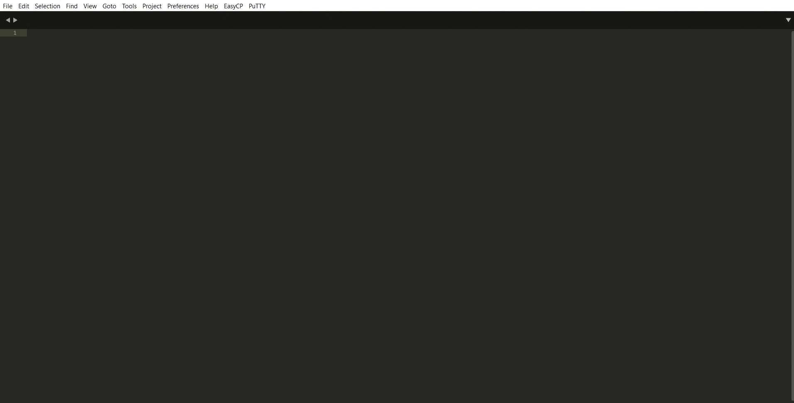

<!--
┌───────────────────────────────────────────┐
│ Copyright (c) 2020-2021 Nikita Paniukhin  │
│      Licensed under the MIT license       │
└───────────────────────────────────────────┘
-->

<h1 align="center">QuickPuTTY</h1>

	
	
	
	 

***QuickPuTTY*** is a plugin for [Sublime Text](https://www.sublimetext.com "Visit sublimetext.com") that allows you to save SSH sessions for quick access to them. It will be useful for those who often use SSH.

Supports folders with a unique navigation system, making it easy to add or remove sessions on the go (manual JSON editing is also possible).

Works with the free open source terminal emulator [PuTTY](https://putty.org "Visit putty.org").

Check out how quickly you can start an SSH session **without entering username and password**:

<h2>Installation</h2>

Plugin is available on [Package Control](https://packagecontrol.io/packages/QuickPuTTY "Visit QuickPuTTY page on packagecontrol.io") and can be installed as follows:

1.  Press <kbd>Ctrl + Shift + P</kbd>, then enter `Package Control: Install Package`
2.  Choose `QuickPuTTY` in the list of available packages

After installation, you can find settings and README by going to `Preferences > Package Settings > QuickPuTTY` in nav-bar.

## Usage

#### Create folder

1.  Go to `PuTTY > New session/folder` in the nav-bar and select `Folder` option
2.  [Choose location](#choosing-location) to place new folder
3.  Enter folder name

#### Create session

1.  Go to `PuTTY > New session/folder` in the nav-bar and select `Session` option
2.  [Choose location](#choosing-location) to place new session
3.  Enter *server host/ip*, *port*, *username* and *password* (last two are optional)

#### Edit sessions and folders

1.  Go to `PuTTY > Manage sessions` in the nav-bar
2.  Edit data
3.  Do not forget to save the file

#### Remove session/folder

1.  Go to `PuTTY > Remove session/folder` in the nav-bar
2.  Select a session or folder you want to remove using the [*Choose location*](#choosing-location) system

### Choosing location

At each stage, you'll see a list of options:

|           item          |                            meaning                                  |
|:-----------------------:|:-------------------------------------------------------------------:|
| ### Choose location ### |                          Just a title                               |
|         \<HERE\>        | Select this if you want to place session/folder in current location |
|        {folder_1}       |            Select a folder name to navigate into it                 |
|          . . .          |                             . . .                                   |

-------------------------------------------

The plugin was tested on `Windows 10 (21H1) x64` and `Ubuntu 18.04.03`.
If you have found a bug, mistake, or a typo, you are very welcome to contact me (e.g. on [npanuhin.me](https://npanuhin.me "Visit npanuhin.me")) or open a [new GitHub issue](https://github.com/npanuhin/QuickPuTTY/issues/new "Create a new GitHub issue in the QuickPuTTY repository").

You can find the latest version of PuTTY on [putty.org](https://putty.org "Visit putty.org")

-------------------------------------------

Copyright © 2021 Nikita Paniukhin

License: [MIT](http://npanuhin.me/license "Visit https://npanuhin.me/license")
